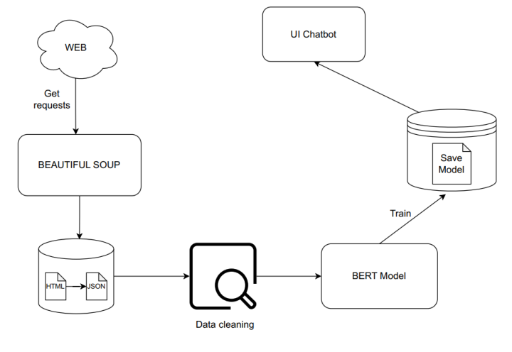
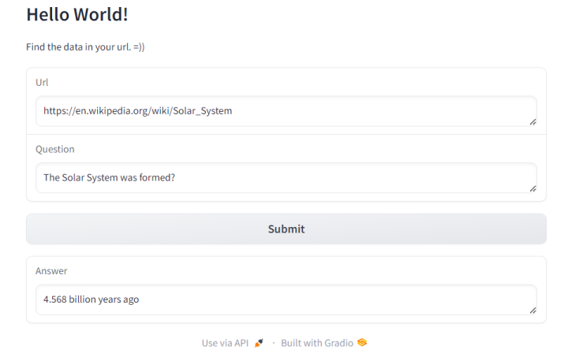

# Crawl_data_chatbot

- This is chatbot use to read data from url and answer base on crawl data 

### BERT
- BERT is a transformers model pretrained on a large corpus of English data in a self-supervised fashion. This means it was pretrained on the raw texts only, with no humans labeling them in any way (which is why it can use lots of publicly available data) with an automatic process to generate inputs and labels from those texts.More precisely, it was pretrained with two objectives:
    - Masked language modeling (MLM)
    - Next sentence prediction (NSP)
- We use bert-based-uncase for pre-trained and SQuAD for dataset
- Pre-trained : [https://huggingface.co/google-bert/bert-base-uncased](https://huggingface.co/google-bert/bert-base-uncased)
- Dataset : [https://rajpurkar.github.io/SQuAD-explorer/](https://rajpurkar.github.io/SQuAD-explorer/)
### Diagram

###  Demo
